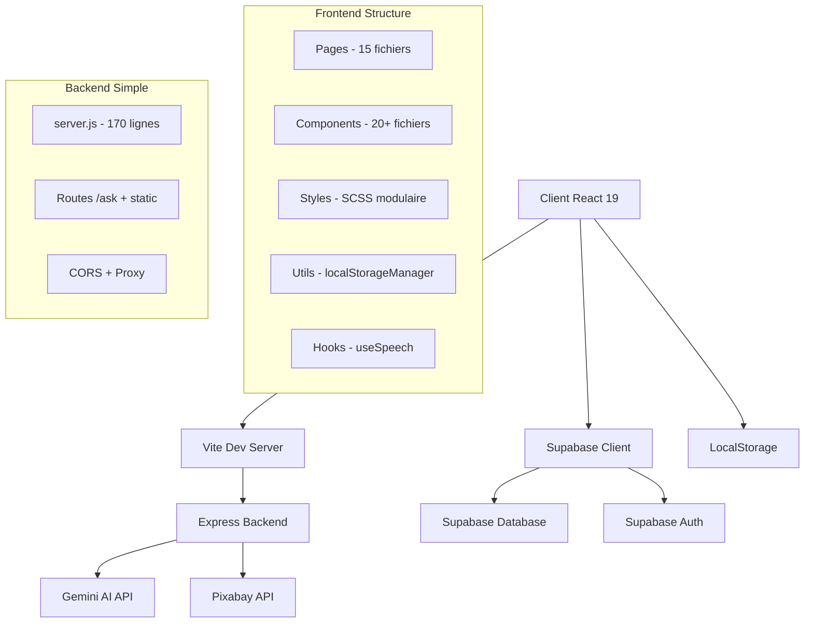
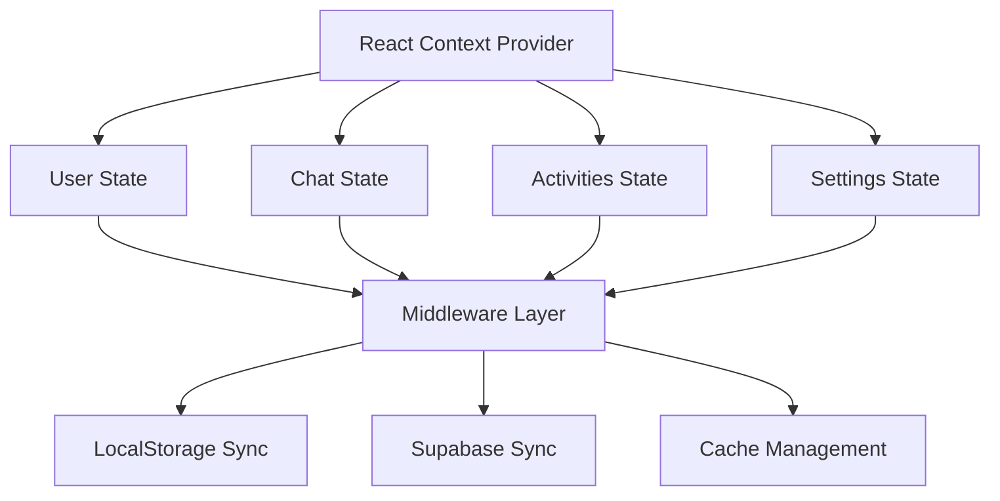
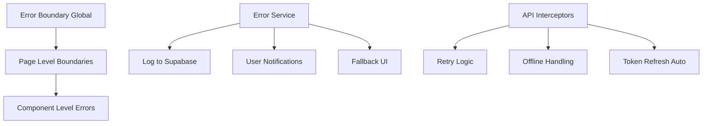
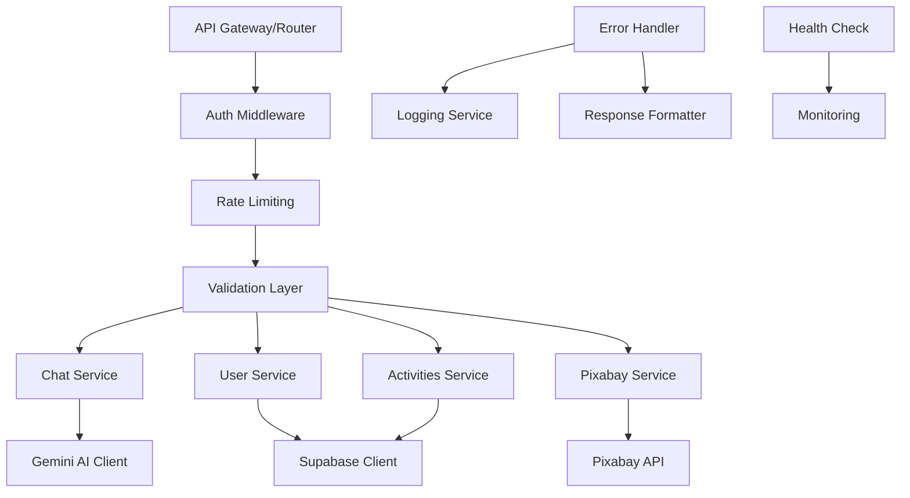

# 🏗️ Plan d'Amélioration Architecture Technique - Olivia APP

## 📊 Analyse de l'Architecture Actuelle

### État Actuel de l'Architecture



### Points Forts Identifiés ✅

1. **Architecture Moderne** : React 19 + Vite pour des performances optimales
2. **Structure Modulaire** : Composants bien séparés par responsabilité
3. **Intégration IA Avancée** : Chat Olivia avec parsing de tags d'action sophistiqué
4. **SCSS Organisé** : Structure modulaire des styles avec variables communes
5. **Hooks Personnalisés** : useSpeech bien implémenté pour l'accessibilité
6. **Authentification Robuste** : Supabase avec OAuth Google intégré
7. **Fonctionnalités Thérapeutiques Riches** : Programme anti-stress, voyages sonores, journal
8. **Gestion d'Urgence** : Système de détection de mots-clés critiques

### Points d'Amélioration Critiques ⚠️

1. **Performance** : Pas de code splitting, bundle potentiellement lourd
2. **State Management** : Props drilling, gestion dispersée dans localStorage
3. **Error Handling** : Pas de boundaries React, gestion d'erreur basique
4. **Testing** : Absence de tests automatisés
5. **Backend Monolithique** : Un seul fichier server.js, pas de structure modulaire
6. **Sécurité** : Validation d'entrée limitée, pas de rate limiting
7. **Monitoring** : Pas de métriques de performance ou d'erreurs
8. **TypeScript** : Application en JavaScript, manque de type safety

## 🎯 Plan d'Amélioration Technique

### 1. **Performance & Optimisation**

#### A. Code Splitting & Lazy Loading

**Problème Actuel** : Tous les composants sont chargés immédiatement
```javascript
// frontend/src/App.jsx - Imports actuels
import Chat from './pages/Chat';
import Profile from './pages/Profile';
// ... 15+ imports directs
```

**Solution Proposée** :
```javascript
// Lazy loading des routes
import { lazy, Suspense } from 'react';

const Chat = lazy(() => import('./pages/Chat'));
const Profile = lazy(() => import('./pages/Profile'));
const StressProgramPage = lazy(() => import('./pages/StressProgramPage'));
const SoundJourney = lazy(() => import('./pages/SoundJourney'));

// Wrapper avec Suspense
function App() {
  return (
    <Router>
      <Suspense fallback={<LoadingSpinner />}>
        <Routes>
          <Route path="/chat" element={<Chat />} />
          {/* ... autres routes */}
        </Routes>
      </Suspense>
    </Router>
  );
}
```

#### B. State Management Centralisé

**Problème** : Props drilling et localStorage dispersé dans multiple composants

**Architecture Recommandée** :


**Structure Proposée** :
```javascript
// src/contexts/AppContext.jsx
const AppContext = createContext();

// src/hooks/useAppContext.js
export const useAppContext = () => useContext(AppContext);

// src/stores/
├── userStore.js
├── chatStore.js
├── activitiesStore.js
└── settingsStore.js
```

#### C. Bundle Optimization

**Métriques Actuelles Estimées** :
- Bundle initial : ~2-3MB (non optimisé)
- Icônes : Material-UI + Lucide (double charge = ~400KB)
- SCSS : Tous les fichiers compilés ensemble
- Images : Non optimisées, formats PNG/JPG

**Optimisations Proposées** :
1. **Vite Bundle Analysis** + Tree shaking configuré
2. **Unification des icônes** (Migration complète vers Lucide React)
3. **CSS Code splitting** par route avec dynamic imports
4. **Image optimization** (conversion WebP + lazy loading + responsive)
5. **Compression** (Gzip/Brotli en production)

**Configuration Vite optimisée** :
```javascript
// vite.config.js amélioré
export default defineConfig({
  plugins: [react()],
  build: {
    rollupOptions: {
      output: {
        manualChunks: {
          vendor: ['react', 'react-dom'],
          ui: ['lucide-react'],
          utils: ['axios', 'date-fns']
        }
      }
    },
    chunkSizeWarningLimit: 1000
  },
  server: {
    proxy: {
      '/api': 'http://localhost:3000'
    }
  }
});
```

### 2. **Maintenabilité & Robustesse**

#### A. Migration TypeScript

**Bénéfices** :
- Type safety pour l'API Gemini et Supabase
- Meilleure Developer Experience avec IntelliSense
- Détection d'erreurs à la compilation
- Documentation automatique des interfaces
- Refactoring plus sûr

**Plan de Migration Progressive** :
1. **Configuration TypeScript** (`tsconfig.json`, `vite.config.ts`)
2. **Typage des interfaces API** (Supabase, Gemini, Pixabay)
3. **Migration des utils et hooks** en premier
4. **Composants types-first** progressivement
5. **Validation runtime** avec Zod pour les API

**Exemples d'interfaces** :
```typescript
// src/types/api.ts
export interface GeminiResponse {
  response: string;
  candidates?: Array<{
    content: {
      parts: Array<{ text: string }>;
    };
  }>;
}

// src/types/user.ts
export interface UserProfile {
  id: string;
  name: string;
  email: string;
  avatar?: string;
  preferences: UserPreferences;
}

// src/types/chat.ts
export interface ChatMessage {
  id: string;
  from: 'user' | 'model';
  text: string;
  displayText: string;
  actionName?: string;
  actionParams?: Record<string, any>;
  timestamp: Date;
}
```

#### B. Architecture Error Handling



**Implémentation proposée** :
```javascript
// src/components/ErrorBoundary.jsx
class ErrorBoundary extends Component {
  constructor(props) {
    super(props);
    this.state = { hasError: false, error: null };
  }

  static getDerivedStateFromError(error) {
    return { hasError: true, error };
  }

  componentDidCatch(error, errorInfo) {
    // Log vers Supabase ou service externe
    errorService.logError(error, errorInfo);
  }

  render() {
    if (this.state.hasError) {
      return <ErrorFallback error={this.state.error} />;
    }
    return this.props.children;
  }
}

// src/services/errorService.js
export const errorService = {
  logError: async (error, context) => {
    await supabase.from('error_logs').insert({
      message: error.message,
      stack: error.stack,
      context,
      user_id: getCurrentUser()?.id,
      timestamp: new Date()
    });
  }
};
```

#### C. Testing Strategy

**Structure Proposée** :
```
tests/
├── unit/
│   ├── components/
│   │   ├── Chat.test.jsx
│   │   ├── OliviaAvatar.test.jsx
│   │   └── StressProgramActivites/
│   ├── hooks/
│   │   ├── useSpeech.test.js
│   │   └── useAppContext.test.js
│   └── utils/
│       ├── localStorageManager.test.js
│       └── apiHelpers.test.js
├── integration/
│   ├── api/
│   │   ├── chat.integration.test.js
│   │   └── auth.integration.test.js
│   └── user-flows/
│       ├── complete-stress-program.test.js
│       └── chat-with-olivia.test.js
└── e2e/
    ├── chat-flow.spec.js
    ├── stress-program.spec.js
    └── user-onboarding.spec.js
```

**Configuration testing** :
```javascript
// vitest.config.js
export default defineConfig({
  test: {
    environment: 'jsdom',
    setupFiles: ['./tests/setup.js'],
    coverage: {
      reporter: ['text', 'html'],
      threshold: {
        global: {
          branches: 70,
          functions: 70,
          lines: 70,
          statements: 70
        }
      }
    }
  }
});
```

### 3. **Architecture Backend Évoluée**

#### Problèmes Actuels Backend

**server.js actuel** : Monolithique (170 lignes)
- Routes mélangées avec logique métier
- Pas de middleware de validation des entrées
- Gestion d'erreur basique sans logging
- Pas de rate limiting pour l'API Gemini
- Configuration d'environnement non validée

#### Architecture Proposée



**Structure de fichiers proposée** :
```
backend/
├── src/
│   ├── controllers/
│   │   ├── chatController.js
│   │   ├── userController.js
│   │   └── activitiesController.js
│   ├── services/
│   │   ├── geminiService.js
│   │   ├── supabaseService.js
│   │   └── pixabayService.js
│   ├── middleware/
│   │   ├── authMiddleware.js
│   │   ├── rateLimitMiddleware.js
│   │   ├── validationMiddleware.js
│   │   └── errorMiddleware.js
│   ├── routes/
│   │   ├── chatRoutes.js
│   │   ├── userRoutes.js
│   │   └── index.js
│   ├── utils/
│   │   ├── logger.js
│   │   ├── validators.js
│   │   └── config.js
│   └── config/
│       ├── database.js
│       └── environment.js
├── tests/
│   ├── unit/
│   ├── integration/
│   └── e2e/
├── docs/
│   └── api.md
└── scripts/
    ├── deploy.js
    └── migrate.js
```

**Exemple de refactoring** :
```javascript
// src/controllers/chatController.js
export const chatController = {
  async sendMessage(req, res, next) {
    try {
      const { messages } = req.body;
      
      // Validation déjà faite par middleware
      const response = await geminiService.generateResponse(messages);
      
      // Log pour analytics
      await loggingService.logChatInteraction(req.user?.id, messages.length);
      
      res.json({ response });
    } catch (error) {
      next(error); // Délégué au error middleware
    }
  }
};

// src/services/geminiService.js
export const geminiService = {
  async generateResponse(messages) {
    const response = await fetch(geminiApiEndpoint, {
      method: 'POST',
      headers: { 'Content-Type': 'application/json' },
      body: JSON.stringify({ contents: this.formatMessages(messages) })
    });
    
    if (!response.ok) {
      throw new APIError(`Gemini API error: ${response.status}`);
    }
    
    return this.parseResponse(await response.json());
  }
};
```

### 4. **Sécurité & Conformité**

#### A. Variables d'Environnement & Secrets

**Problème Actuel** : 
```javascript
// Validation basique sans fallback sécurisé
const GEMINI_API_KEY = process.env.GEMINI_API_KEY;
if (!GEMINI_API_KEY) {
  console.error("Clé API Gemini manquante");
  process.exit(1);
}
```

**Solution Sécurisée** :
```javascript
// src/config/environment.js
import { z } from 'zod';

const envSchema = z.object({
  NODE_ENV: z.enum(['development', 'production', 'test']),
  GEMINI_API_KEY: z.string().min(1),
  SUPABASE_URL: z.string().url(),
  SUPABASE_ANON_KEY: z.string().min(1),
  PIXABAY_API_KEY: z.string().optional(),
  JWT_SECRET: z.string().min(32),
  CORS_ORIGIN: z.string().url().array().optional(),
  RATE_LIMIT_MAX: z.number().int().positive().default(100),
  RATE_LIMIT_WINDOW: z.number().int().positive().default(900000) // 15min
});

export const config = envSchema.parse(process.env);

// src/config/security.js
export const securityConfig = {
  cors: {
    origin: config.NODE_ENV === 'production' 
      ? config.CORS_ORIGIN 
      : ['http://localhost:3000', 'http://localhost:5173'],
    credentials: true,
    optionsSuccessStatus: 200
  },
  rateLimit: {
    windowMs: config.RATE_LIMIT_WINDOW,
    max: config.RATE_LIMIT_MAX,
    message: 'Trop de requêtes, réessayez plus tard',
    standardHeaders: true,
    legacyHeaders: false
  }
};
```

#### B. Validation & Sanitization

```javascript
// src/middleware/validationMiddleware.js
import { z } from 'zod';

const chatMessageSchema = z.object({
  messages: z.array(z.object({
    from: z.enum(['user', 'model']),
    text: z.string().min(1).max(4000) // Limite raisonnable
  })).min(1).max(50) // Limite conversation
});

export const validateChatMessage = (req, res, next) => {
  try {
    req.body = chatMessageSchema.parse(req.body);
    next();
  } catch (error) {
    res.status(400).json({ 
      error: 'Données invalides', 
      details: error.errors 
    });
  }
};

// Sanitization des entrées utilisateur
export const sanitizeUserInput = (req, res, next) => {
  if (req.body.messages) {
    req.body.messages = req.body.messages.map(msg => ({
      ...msg,
      text: DOMPurify.sanitize(msg.text, { ALLOWED_TAGS: [] })
    }));
  }
  next();
};
```

#### C. Conformité RGPD

**Données sensibles identifiées** :
- Messages chat avec Olivia (données de santé mentale)
- Données journal personnel (entrées libres utilisateur)
- Historique activités (patterns comportementaux)
- Profil utilisateur (préférences, avatars)
- Logs d'erreurs (potentiellement avec données personnelles)

**Plan de conformité** :
1. **Audit des données** collectées et stockées
2. **Encryption at rest** (Supabase Row Level Security)
3. **Data retention policies** automatisées
4. **Export/suppression** utilisateur (GDPR requests)
5. **Consent management** explicit et granulaire
6. **Anonymisation** des analytics et logs

```javascript
// src/services/gdprService.js
export const gdprService = {
  async exportUserData(userId) {
    const userData = await supabase
      .from('user_profiles')
      .select('*')
      .eq('id', userId)
      .single();
      
    const chatHistory = await supabase
      .from('chat_messages')
      .select('*')
      .eq('user_id', userId);
      
    const journalEntries = await supabase
      .from('journal_entries')
      .select('*')
      .eq('user_id', userId);
      
    return {
      profile: userData.data,
      chatHistory: chatHistory.data,
      journalEntries: journalEntries.data,
      exportDate: new Date().toISOString()
    };
  },
  
  async deleteUserData(userId) {
    // Suppression en cascade de toutes les données
    await supabase.rpc('delete_user_completely', { user_id: userId });
  }
};
```

### 5. **Performance Monitoring & Observabilité**

#### Architecture Observabilité

```mermaid
graph TD
    A[Frontend Metrics] --> B[Core Web Vitals]
    A --> C[Error Tracking]
    A --> D[User Journey Analytics]
    
    E[Backend Metrics] --> F[Response Times]
    E --> G[Error Rates]
    E --> H[Resource Usage]
    E --> I[API Usage Patterns]
    
    J[Supabase Metrics] --> K[Query Performance]
    J --> L[Connection Pool Health]
    J --> M[RLS Policy Performance]
    
    N[External APIs] --> O[Gemini Response Times]
    N --> P[Pixabay Availability]
    
    Q[Alerting System] --> R[Slack/Email Notifications]
    Q --> S[Auto-scaling Triggers]
    Q --> T[Health Check Failures]
```



**Implémentation Frontend** :
```javascript
// src/utils/analytics.js
export const analytics = {
  // Performance monitoring
  trackPageLoad(pageName) {
    const navigation = performance.getEntriesByType('navigation')[0];
    this.send('page_load', {
      page: pageName,
      loadTime: navigation.loadEventEnd - navigation.loadEventStart,
      domContentLoaded: navigation.domContentLoadedEventEnd - navigation.domContentLoadedEventStart
    });
  },
  
  // Error tracking
  trackError(error, context) {
    this.send('error', {
      message: error.message,
      stack: error.stack,
      context,
      userAgent: navigator.userAgent,
      timestamp: Date.now()
    });
  },
  
  // User interaction tracking
  trackOliviaInteraction(actionType, duration) {
    this.send('olivia_interaction', {
      action: actionType,
      duration,
      timestamp: Date.now()
    });
  }
};

// src/hooks/usePerformanceMonitoring.js
export const usePerformanceMonitoring = () => {
  useEffect(() => {
    // Monitor Core Web Vitals
    import('web-vitals').then(({ getCLS, getFID, getFCP, getLCP, getTTFB }) => {
      getCLS(analytics.send.bind(analytics, 'cls'));
      getFID(analytics.send.bind(analytics, 'fid'));
      getFCP(analytics.send.bind(analytics, 'fcp'));
      getLCP(analytics.send.bind(analytics, 'lcp'));
      getTTFB(analytics.send.bind(analytics, 'ttfb'));
    });
  }, []);
};
```

**Monitoring Backend** :
```javascript
// src/middleware/metricsMiddleware.js
export const metricsMiddleware = (req, res, next) => {
  const startTime = Date.now();
  
  res.on('finish', () => {
    const duration = Date.now() - startTime;
    
    metrics.record('http_request_duration', duration, {
      method: req.method,
      route: req.route?.path || 'unknown',
      status: res.statusCode
    });
    
    if (res.statusCode >= 400) {
      metrics.increment('http_errors', {
        status: res.statusCode,
        route: req.route?.path || 'unknown'
      });
    }
  });
  
  next();
};

// src/services/healthCheck.js
export const healthCheck = {
  async checkDependencies() {
    const checks = {
      supabase: await this.checkSupabase(),
      gemini: await this.checkGemini(),
      pixabay: await this.checkPixabay()
    };
    
    const isHealthy = Object.values(checks).every(check => check.status === 'ok');
    
    return {
      status: isHealthy ? 'healthy' : 'unhealthy',
      timestamp: new Date().toISOString(),
      checks
    };
  }
};
```

## 📋 Plan d'Implémentation Priorisé

### Phase 1 : Fondations Solides (2-3 semaines)

**Objectifs** : Stabiliser la base de code et améliorer la maintenabilité
- **Migration TypeScript** (configuration + interfaces critiques API)
- **State Management** (Context API + localStorage synchronization)
- **Error Boundaries** (global + pages principales)
- **Code Splitting** (lazy loading des routes principales)
- **Linting & Formatting** (ESLint + Prettier configuration)

**Livrable** : Application plus robuste avec type safety

### Phase 2 : Optimisation Performance (2-3 semaines)  

**Objectifs** : Améliorer les performances utilisateur
- **Bundle Optimization** (Vite configuration avancée + tree shaking)
- **API Layer** refactoring (axios interceptors + retry logic)
- **Cache Strategy** (React Query pour la gestion d'état serveur)
- **Image Optimization** (WebP conversion + lazy loading)
- **CSS Optimization** (code splitting + critical CSS)

**Livrable** : Application significativement plus rapide

### Phase 3 : Robustesse & Sécurité (3-4 semaines)

**Objectifs** : Sécuriser l'application et la rendre production-ready
- **Backend Architecture** (refactoring en services + middleware)
- **Testing Suite** (unit tests + integration tests)
- **Security Hardening** (validation, CORS, rate limiting)
- **GDPR Compliance** (data retention + user rights)
- **Error Monitoring** (centralized logging + alerting)

**Livrable** : Application sécurisée et conforme

### Phase 4 : Scaling & Monitoring (2-3 semaines)

**Objectifs** : Préparer la montée en charge
- **Performance Monitoring** (dashboards + alerting)
- **Documentation** (API documentation + component library)
- **CI/CD Pipeline** (GitHub Actions + automated deployments)
- **Production Optimizations** (CDN + caching strategies)
- **Load Testing** (stress testing + capacity planning)

**Livrable** : Application ready for scale

## 🎯 Métriques de Succès

### Performance
- **Bundle size initial** : < 1MB (vs ~2-3MB estimé actuellement)
- **Time to Interactive** : < 3s (vs ~5-8s estimé)
- **Lighthouse Performance Score** : > 90
- **Core Web Vitals** : Tous en vert (LCP < 2.5s, FID < 100ms, CLS < 0.1)

### Maintenabilité  
- **TypeScript Coverage** : > 80%
- **Test Coverage** : > 70% (unit + integration)
- **Documentation Coverage** : 100% des API endpoints
- **ESLint Errors** : 0 (strict mode)

### Robustesse
- **Error Rate** : < 1% (frontend + backend)
- **Uptime** : > 99.5%
- **Security Score** : A+ (observatory.mozilla.org)
- **GDPR Compliance** : 100% audit passed

### User Experience
- **Chat Response Time** : < 3s (API Gemini)
- **Page Load Time** : < 2s (toutes pages)
- **Mobile Performance** : Score > 85
- **Accessibility** : WCAG 2.1 AA compliant

## 🔧 Outils & Technologies Recommandés

### Development
- **TypeScript** : Type safety + better DX
- **Vite** : Fast builds + HMR optimisé
- **ESLint + Prettier** : Code quality + consistency
- **Husky + lint-staged** : Pre-commit hooks

### Testing
- **Vitest** : Fast unit testing
- **React Testing Library** : Component testing
- **Playwright** : E2E testing
- **MSW** : API mocking

### Monitoring
- **Sentry** : Error tracking + performance
- **LogRocket** : Session replay + debugging
- **Google Analytics 4** : User analytics
- **Supabase Analytics** : Backend metrics

### Deployment
- **Vercel/Netlify** : Frontend hosting optimisé
- **Railway/Render** : Backend hosting avec auto-deploy
- **GitHub Actions** : CI/CD pipeline
- **Cloudflare** : CDN + security

## 📚 Ressources & Documentation

### Architecture References
- [React Performance Best Practices](https://react.dev/learn/render-and-commit)
- [Vite Performance Guide](https://vitejs.dev/guide/performance.html)
- [TypeScript Migration Guide](https://www.typescriptlang.org/docs/handbook/migrating-from-javascript.html)
- [GDPR Compliance Checklist](https://gdpr.eu/checklist/)

### Security Guidelines
- [OWASP Top 10](https://owasp.org/www-project-top-ten/)
- [Node.js Security Best Practices](https://nodejs.org/en/docs/guides/security/)
- [Supabase Security Guide](https://supabase.com/docs/guides/auth/row-level-security)

### Performance Tools
- [Lighthouse CI](https://github.com/GoogleChrome/lighthouse-ci)
- [Web Vitals](https://web.dev/vitals/)
- [Bundle Analyzer](https://github.com/webpack-contrib/webpack-bundle-analyzer)

---

**Document créé le** : 29/06/2025  
**Version** : 1.0  
**Auteur** : Kilo Code (Architect Mode)  
**Projet** : Olivia APP - Application de Thérapie Numérique